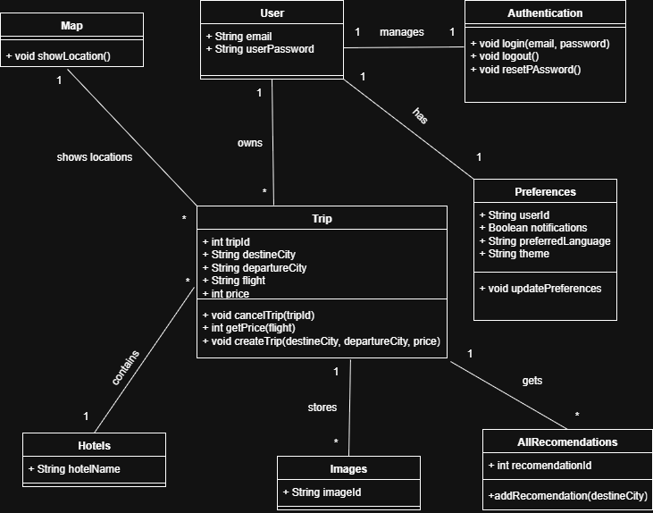

# 📐 Diseño Arquitectónico de Travel Planner

## 🎨 Paleta de Colores

| Nombre | Hex | Uso |
|---|---|---|
| CheeseYellow | `#FFCA28` | Primary (tema oscuro) |
| CheeseYellowDark | `#F9A825` | Primary (tema claro) |
| CheeseYellowDim | `#FFE082` | onBackground (tema oscuro) |
| TailPink | `#F48FB1` | Secondary (tema oscuro) |
| TailPinkDark | `#C2185B` | Secondary (tema claro) |
| RatGrey | `#757575` | Tertiary (tema claro) |
| RatGreyDark | `#424242` | onBackground (tema claro) |
| RatGreyLight | `#BDBDBD` | Tertiary / onSurface (tema oscuro) |
| SewerDark | `#1A1A2E` | Background (tema oscuro) |
| SewerSurface | `#23233A` | Surface (tema oscuro) |
| SewerLight | `#F5F0E8` | Background (tema claro) |

---

## 🧭 Navegación

Se usa **Jetpack Navigation Compose** con `NavGraph.kt` centralizado.

Rutas definidas:

| Ruta | Pantalla |
|---|---|
| `splash` | SplashScreen *(startDestination)* |
| `home` | HomeScreen |
| `agenda` | Agenda |
| `configuracion` | Configuracion |
| `cambiar_idioma` | CambiarIdioma |

---

## 🎬 Splash Screen

Implementada en Compose mediante `SplashScreen.kt`. Muestra un GIF animado del logo (`logo_animation.gif`) durante 3 segundos usando la librería **Coil** con soporte de GIF (`coil-gif`). Tras el tiempo de espera navega a `home` eliminando la splash del backstack.
## 📊 Modelo de Datos: Creado completo para futuros Sprints

